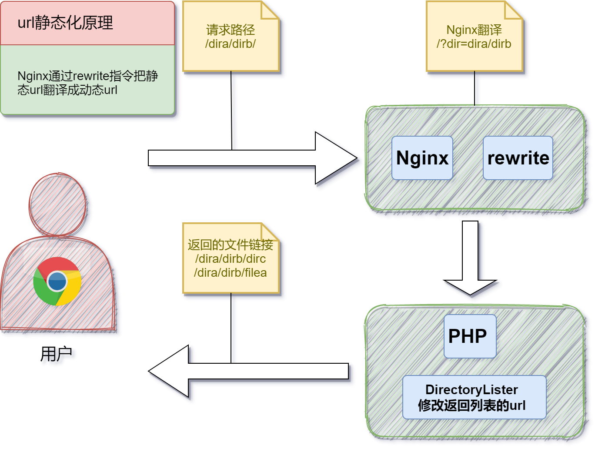

**[在线DEMO](https://demo.maplesugar.top/directory-lister/)** ，登录密码：1234。

### DirectoryLister修改总览

不会php，简单看了一下语法，自行判断是否使用。

对应的DirectoryLister版本是`DirectoryLister-3.8.3.zip`，简单修改了以下几点：

- 添加登录页面
- 添加page view计数
- 谷歌字体源替换为国内CDN
- 设置favicon和logo图片
- url静态化

### DirectoryLister修改注意事项

修改视图文件twig后，需要清空缓存`app/cache/views/`。

### 使用方法

把`DirectoryLister-3.8.3-modify`目录中的文件覆盖到DirectoryLister的安装目录即可，然后修改`login.php`中的`$password`。

## 下面是具体的修改

### 添加登录页面

新增文件：login.php，修改密码。

```php login.php
$password="1234";
```

修改文件：index.php。

```php index.php
require "login.php";
```

### 添加page view计数

新增文件：pageview.php。

修改文件：index.php、app/src/Controllers/DirectoryController.php、app/views/components/footer.twig。

修改视图文件.twig后，需要删除app/cache/views生效。

```php index.php
index.php

require "pageview.php";
```

```php app/src/Controllers/DirectoryController.php
app/src/Controllers/DirectoryController.php

// 获得 page view 计数
$pageview_file = "pageview.dat";
$pvf = fopen($pageview_file,"r");
$pv_counter = trim(fgets($pvf));
fclose($pvf);
return $this->view->render($response, 'index.twig', [
    'files' => $files,
    'path' => $path,
    'pv_counter' => $pv_counter,
    // 部署路径给twig模板
    'web_path' => WEB_PATH,
    'readme' => $this->readme($files),
    'title' => $path == '.' ? 'Home' : $path,
]);
```

```php app/views/components/footer.twig
app/views/components/footer.twig

<p class="mb-4">
    枫糖目录<span style="margin: 0 .5em;">|</span>访问了<span id="footer-visit-count">{{ pv_counter }}</span>次
</p>
```

### 谷歌字体源替换为国内CDN
```css /app/accets/app.css
/app/accets/app.css

/* @import url(https://fonts.googleapis.com/css2?family=Source+Code+Pro&family=Work+Sans&display=swap); */
/* 谷歌字体源替换为国内CDN */
@import url(https://fonts.googleapis.cnpmjs.org/css?family=Noto+Serif+SC:normal);
/* 把所有字体替换成 Noto Serif SC，这种衬线字体 */
*:not(i) {
    font-family:'Noto Serif SC','Microsoft YaHei',sans-serif !important;
}
```

```html app/views/layouts/app.twig
app/views/layouts/app.twig

<link rel="dns-prefetch" href="//fonts.googleapis.cnpmjs.org">
<link rel="preconnect" href="https://fonts.googleapis.cnpmjs.org">
```
### 设置favicon和logo图片

```html app/views/layouts/app.twig
app/views/layouts/app.twig

<link rel="icon" href="{{ asset('images/owl.png') }}">
```

```html  app/views/components/header.twig
app/views/components/header.twig

<a href="{{ web_path }}" class="flex items-center space-x-2 p-1" title="{{ config('site_title') }}">
    
</a>
```

### url静态化

- 默认的url是`/?dir=dirname`的形式，说明DirectoryLister始终在第一层文件夹，访问子文件夹中readme.md，它引用图片的时候，就会404。
- 由于修改DirectoryLister处理`/?dir=dirname`的内容比较困难，所以使用nginx的`rewrite`指令。
- nginx`rewrite`后，访问子文件夹，DirectoryLister引用资源路径是`app/accets/app.css`，也会404，需要修改路径为根路径`/app/accets`。



nginx根路径部署DirectoryLister。

```conf conf.d/demo.conf
root   /usr/share/nginx/html/demo;
index  index.php;

location / {
	rewrite ^/(.*)/$ /?dir=$1 break;
}
```

nginx子路径部署DirectoryLister。

```conf conf.d/demo.conf
root   /usr/share/nginx/html/demo;
index  index.php;

location /directory-lister {
	rewrite ^/directory-lister/(.*)/$ /directory-lister/?dir=$1 break;
}
```

下面是对DirectoryLister的修改。

```php index.php
index.php

// 获取程序部署目录：根目录？子目录？
if (dirname($_SERVER['PHP_SELF']) == DIRECTORY_SEPARATOR){
    $web_path = '/.';
} else {
    $web_path = dirname($_SERVER['PHP_SELF']);
}
define('WEB_PATH', $web_path);
```

```php app/src/ViewFunctions/FileUrl.php
app/src/ViewFunctions/FileUrl.php

public function __invoke(string $path = '/'): string
{
    $path = $this->stripLeadingSlashes($path);

    /*
    if (is_file($path)) {
        return $this->escape($path);
    }
    */

    if (is_file($path)) {
        return $this->escape(WEB_PATH . '/' . $path);
    }

    if ($path === '') {
        return '';
    }

    // return sprintf('?dir=%s', $this->escape($path));
    return $this->escape(WEB_PATH . '/' . $path . '/');
}
```

```php app/src/ViewFunctions/ParentUrl.php
app/src/ViewFunctions/ParentUrl.php

public function __invoke(string $path): string
{
    $parentDir = Str::explode($path, $this->directorySeparator)->map(
        static function (string $segment): string {
            return rawurlencode($segment);
        }
    )->filter(static function (?string $value): bool {
        return $value !== null;
    })->slice(0, -1)->implode($this->directorySeparator);

    /*
    if ($parentDir === '') {
        return '.';
    }
    */

    if ($parentDir === '') {
        return WEB_PATH . '/';
    }

    // return sprintf('?dir=%s', $parentDir);
    return WEB_PATH . '/' . $parentDir . '/';
}
```

```php app/src/ViewFunctions/Breadcrumbs.php
app/src/ViewFunctions/Breadcrumbs.php

public function __invoke(string $path): Collection
{
    return Str::explode($path, $this->directorySeparator)->diff(
        explode($this->directorySeparator, $this->config->get('base_path'))
    )->filter(static function (string $crumb): bool {
        return ! in_array($crumb, [null, '.']);
    })->reduce(function (Collection $carry, string $crumb): Collection {
        return $carry->put($crumb, ltrim(
            $carry->last() . $this->directorySeparator . rawurlencode($crumb), $this->directorySeparator
        ));
    }, new Collection)->map(static function (string $path): string {
        // return sprintf('?dir=%s', $path);
        return WEB_PATH . '/' . $path . '/';
    });
}
```

```php app/src/ViewFunctions/Asset.php
app/src/ViewFunctions/Asset.php

public function __invoke(string $path): string
{
    $path = '/' . ltrim($path, '/');

    if ($this->mixManifest()->has($path)) {
        $path = $this->mixManifest()->get($path);
    }

    // return 'app/assets/' . ltrim($path, '/');
    return WEB_PATH . '/app/assets/' . ltrim($path, '/');
}
```

```php app/src/Controllers/DirectoryController.php
app/src/Controllers/DirectoryController.php

// 获得 page view 计数
$pageview_file = "pageview.dat";
$pvf = fopen($pageview_file,"r");
$pv_counter = trim(fgets($pvf));
fclose($pvf);
return $this->view->render($response, 'index.twig', [
    'files' => $files,
    'path' => $path,
    'pv_counter' => $pv_counter,
    // 部署路径给twig模板
    'web_path' => WEB_PATH,
    'readme' => $this->readme($files),
    'title' => $path == '.' ? 'Home' : $path,
]);
```

```php app/src/Controllers/SearchController.php
app/src/Controllers/SearchController.php

if ($files->count() === 0) {
    return $this->view->render($response, 'error.twig', [
        'message' => $this->translator->trans('error.no_results_found'),
        'search' => $search,
        // 部署路径给twig模板
        'web_path' => WEB_PATH,
    ]);
}

return $this->view->render($response, 'index.twig', [
    'files' => $files,
    'search' => $search,
    'title' => $search,
    // 部署路径给twig模板
    'web_path' => WEB_PATH,
]);
```

```php app/views/components/breadcrumbs.twig
app/views/components/breadcrumbs.twig

<a href="{{ web_path }}" class="inline-block hover:underline">
    {{ config('home_text') | default(translate('home')) }}
</a>
```
